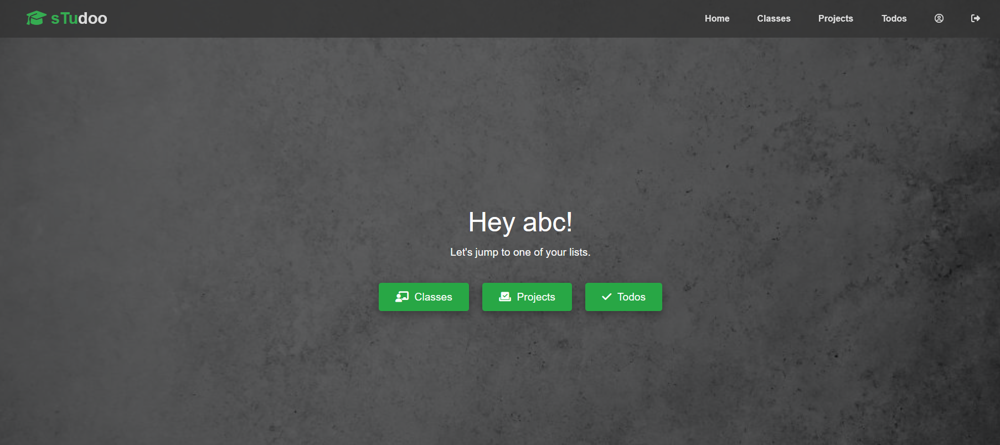
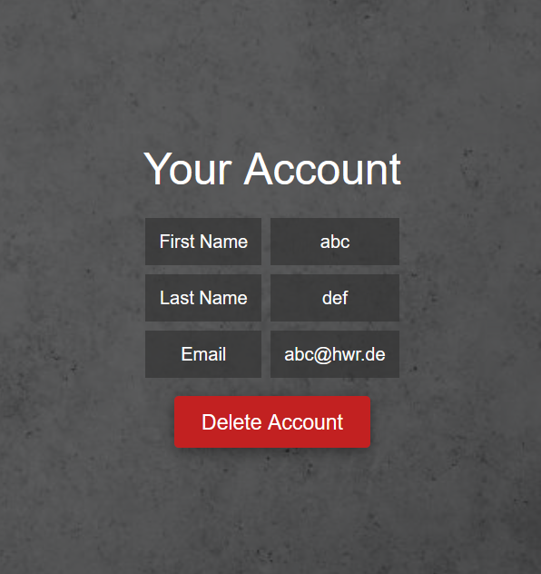
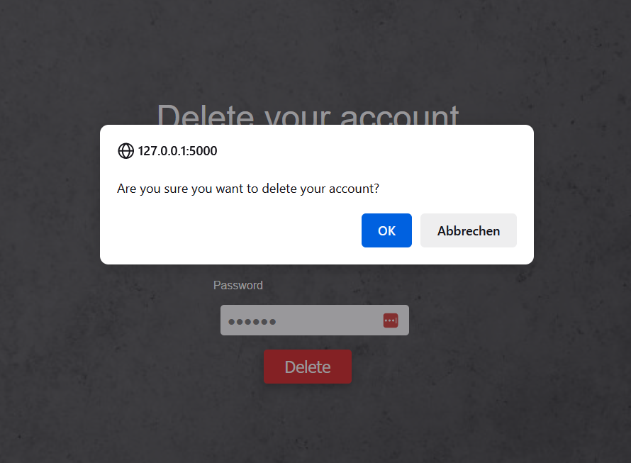
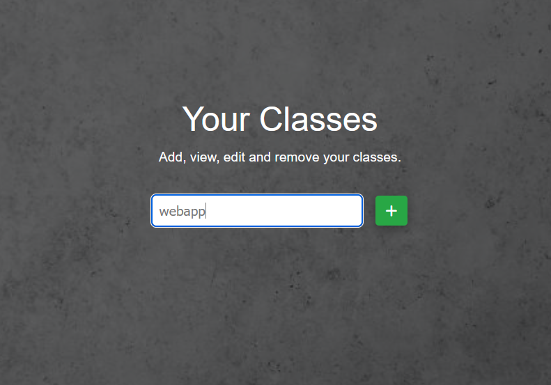
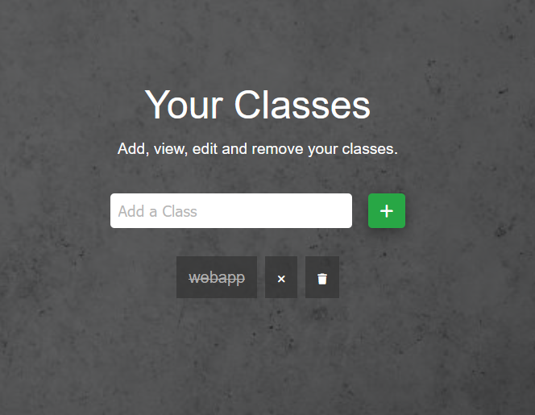
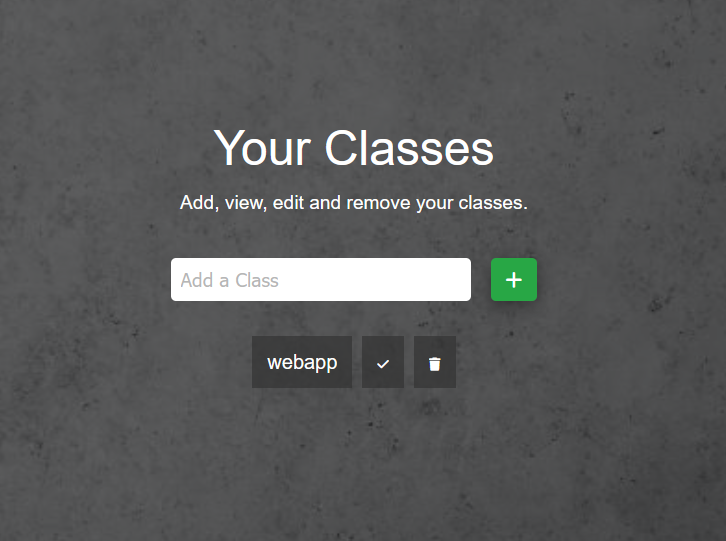
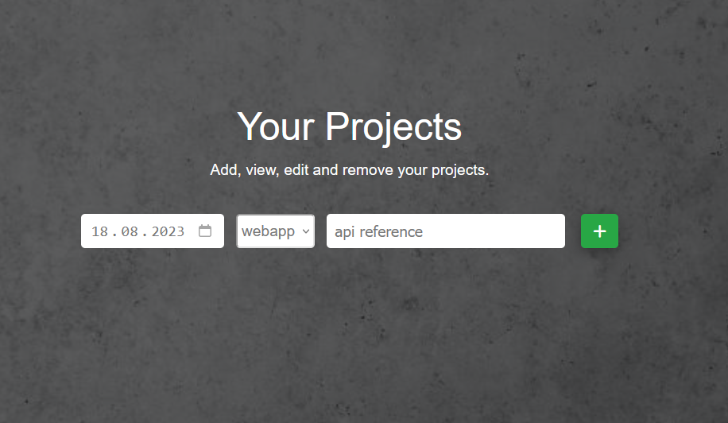
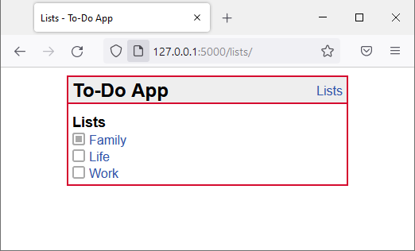

[Jana Kusch]

[Andreas Moor]
{: .label }

# [API reference]
{: .no_toc }

  

    Table of contents
  

  {: .text-delta }
- TOC
{:toc}

## [Section / module]

### `function_definition()`

---

---

**Route:** `/index`

**Methods:** `GET`

**Purpose:**  Displays the `index.html` template with the title set to **`sTudoo`**.

**Sample output:**

---

**Route:** `/imprint`

**Methods:** `GET`

**Purpose:** Display the `imprint.html` template with the title set to "Imprint".

**Sample output:**

---

**Route:** `/privacy`

**Methods:** `GET`

**Purpose:** Display the `privacy.html` template with the title set to "Privacy".

**Sample output:**

---

### **Route:** `/sign_up`

**Methods:** `POST`, `GET`

**Purpose:** This route handles user registration. If the request method is `POST`, it retrieves user input data from the form, checks if all required fields are filled, and inserts the user data into the database. If any field is missing, a flash message is displayed. It returns the sign-up page for user registration until all fields are filled out or displays the "You're Signed Up" page after successful registration.

**Sample output:**

  

---

### **Route:** `/signed_up`

**Methods:** `GET`

**Purpose:** This route displays a template that confirms successful user registration. It's called after the user has successfully signed up.

**Sample output:**

---

### **Route:** `/login`

**Methods:** `POST`, `GET`

**Purpose:** This route handles user login. If the request method is `POST`, it retrieves the user's input email and password, queries the database for a matching user, and logs in the user by storing their user ID in the session. If a user is logged in, they are redirected to the "You're Logged In" page.

**Sample output:**

---

### **Route:** `/logedin`

**Methods:** `GET`, `POST`

**Purpose:** This route verifies if a user is logged in by checking their user ID in the session. If the user is logged in, their information (first_name) is fetched from the database and displayed on the "You're Logged In" page. If the user is not logged in, they are redirected to the login page.

**Sample output:**

---

### **Route:** `/logout`

**Methods:** `GET`

**Purpose:** This route handles user logout. It clears the session, displays a flash message confirming the logout, and redirects the user to the homepage ("index").

**Sample output:**

 

---

### **Route:** `/useraccount`

**Methods:** `GET`

**Purpose:** This route displays the user's account information. It checks if the user is logged in, retrieves the user's data from the database, and displays it on the "User Account" page.

**Sample output:**

---

### **Route:** `/delete_account`

**Methods:** `POST`

**Purpose:** This route handles user account deletion. If the user submits the form with their email and password, the route attempts to delete the account by calling `delete_user`. If successful, it displays the "Account Deleted" page. If the provided email or password is incorrect, an error message is returned.

**Sample output:**

---

### **Route:** `/delete_site`

**Methods:** `GET`

**Purpose:** This route displays a confirmation page for account deletion. Users can access this page to confirm their intention to delete their account by receiving email and password.

**Sample output:**
 

---

### **Function:** `update_status(class_id, status)`

**Purpose:** This function updates the completed status of a class and its associated projects and todos. The function takes a `class_id` and a `status` parameter. If `status` is `0`, the function sets the completed status of the class and its dependencies to `0`. If `status` is `1`, it sets the completed status of the class and its dependencies to `1`.

**Sample output:** NONE

---

### **Route:** `/classes`

**Methods:** `GET`, `POST`

**Purpose:** This route manages the user's classes. If the user is not logged in, they are redirected to the login page. If the request method is `POST`, the route handles various actions based on the form submission: adding a new class, marking a class as completed, or marking it as not completed.

- **Adding a Class:** If the `add_class` button is pressed, the route inserts a new class into the database with the user's ID and the provided class name.

- **Marking Completed/Incompleted:** If the `mark_completed` button (hook-icon) is pressed, the `update_status` function is called with the `class_id` and `status` set to `1`, marking the class as completed. If the `mark_incompleted` (x-icon) button is pressed, the function is called with the `class_id` and `status` set to `0`, marking the class as not completed.

After handling the POST requests, the route retrieves the list of classes and their statuses (completed = 0 or 1) from the database. The class list is then displayed in the template, with completed classes displayed with a line-through.

**Sample output:**

 

 

---

### **Route:** `/projects`

**Methods:** `GET`, `POST`

**Purpose:** This route manages the user's projects. If the user is logged in, they can add new projects using the `Post` method to incompleted (boolean = 0) classes that can be individually selected from a dropdown-menu.  

- **Adding a Project:** If the `add_project` button is pressed, the route inserts a new project into the database associated with the selected class.

**Sample output:**

 

---

### **Route:** `/get_projects`

**Methods:** `GET`

**Purpose:** This route is used to retrieve projects for a specific class. It takes the `class_id` as a query parameter and returns the projects associated with that class in JSON format. It is used by the todos route to dynamically populate the projects dropdown-menu without having to reload the page. 

**Sample output:** Dynamically populated dropdown-list: 

 

---
### **Route:** `/todos`

**Methods:** `GET`, `POST`

**Purpose:** This route manages the user's todos. If the user is logged in, it retrieves and displays the list of classes with non-completed status, available projects for those classes, and todos for the user. Users can add new todos to the selected project using the `POST` method.

- **Adding a Todo:** If the `add_todo` button is pressed, the route inserts a new todo into the database associated with the selected class and project.

**Sample output:**

 

---

### **Route:** `/delete_entry`

**Methods:** `POST`

**Purpose:** Delete an entry (class, project, or todo) based on the provided entry ID and type.

**Sample output:**

 

---

## [Example, delete this section] Show to-do lists

### `get_lists()`

**Route:** `/lists/`

**Methods:** `GET`

**Purpose:** Show all to-do lists.

**Sample output:**

---

### `get_list_todos(list_id)`

**Route:** `/lists/<int:list_id>`

**Methods:** `GET`

**Purpose:** Retrieve all to-do items of to-do list with ID `list_id` from database and present to user.

**Sample output:**

---
**Route:** `/route/`

**Methods:** `POST` `GET` `PATCH` `PUT` `DELETE`

**Purpose:** [Short explanation of what the function does and why]

**Sample output:**

[Show an image, string output, or similar illustration -- or write NONE if function generates no output]