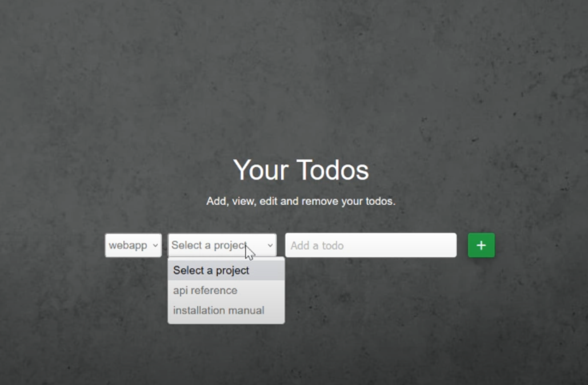

Jana
{: .label }

# API Reference

  

    Table of contents
  

  {: .text-delta }
- TOC
{:toc}

## **Function:** `update_status(class_id, status)`

**Purpose:** This function updates the completed status of a class and its associated projects and todos. The function takes a `class_id` and a `status` parameter. If `status` is `0`, the function sets the completed status of the class and its dependencies to `0`. If `status` is `1`, it sets the completed status of the class and its dependencies to `1`.

**Sample output:** NONE

## **JSON:** `/get_projects`

**Methods:** `GET`

**Purpose:** This route is used to retrieve projects for a specific class. It takes the `class_id` as a query parameter and returns the projects associated with that class in JSON format. It is used by the todos route to dynamically populate the projects dropdown-menu without having to reload the page. 

**Sample output:** Dynamically populated dropdown-list: 

 

